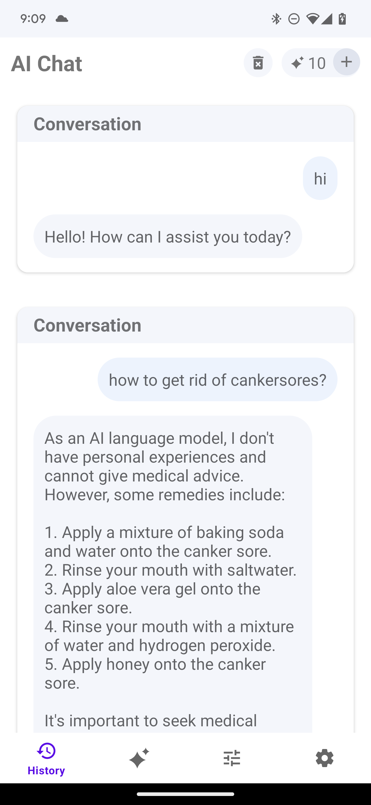

# AI Chat App (MattChat)
Android App to interface with OpenAI GPT models [unreleased due to cost]

## Table of Contents
- [Features](#features)
- [Screenshots](#screenshots)
- [Technologies Used](#technologies-used)

## Features
- AI-powered chat functionality
- Real-time message delivery
- Storing past chats
- Fun and useful preset prompts

## Screenshots

    
    
    

## Technologies Used
- Android SDK
- OkHttp for network requests
- JSON for data handling
- SQLite Database for local storage
- SharedPreferences for managing key-value pairs of num chats left in free trial
- RecyclerView for efficient UI message display
- Spinner for selecting AI models
- Gson for JSON serialization/deserialization
- OpenAI API for AI chat completion requests

